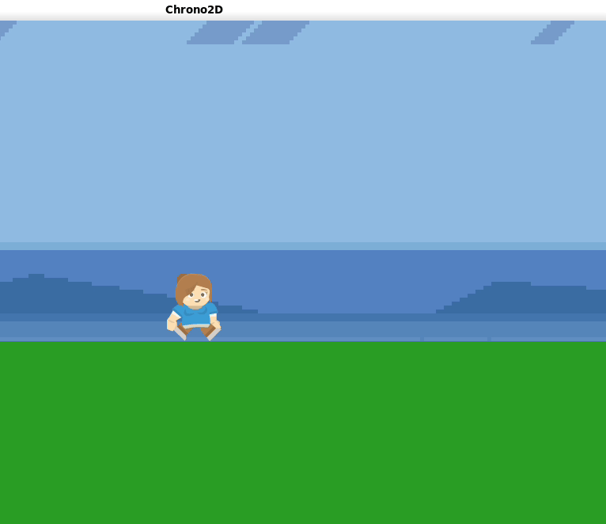

# ⏳ Chrono2D

---

A full report is available [here](https://github.com/DupuisB/Chrono2D/blob/main/report.pdf) (report.pdf).

---

[](https://isocpp.org/)
[](https://www.sfml-dev.org/)
[](https://box2d.org/)
[](https://shields.io/)

Chrono2D is a 2D platformer built with C++, SFML, and Box2D. Players navigate levels filled with physics-based puzzles (Rigid Body Physics) and challenges, using a unique **time-freeze mechanic** to creatively interact with the environment.

---

## 🎮 Gameplay Demo



### 🕹️ Controls

*   **Move:** Arrow keys
*   **Jump:** Space
*   **Freeze/Unfreeze Time:** F
*   **Reset Level:** R

---

## 🛠️ Technical Highlights

The primary challenge of this project was to architect a system that seamlessly links a discrete physics library (Box2D) with a rendering library (SFML) **without using a game engine**.

*   **`GameObject` Abstraction:** The core of our architecture is a robust wrapper class that unifies an entity's physical (Box2D `b2Body`) and visual (SFML `sf::Sprite`) properties. This dramatically streamlined development and level creation.
*   **Custom Physics/Graphics Synchronization:** We built a custom game loop running physics on a fixed timestep for determinism while allowing rendering to run at a variable framerate.
*   **Engineered from Scratch:** This project is a demonstration of building a game framework from the ground up, managing the game loop, state, and the interface between distinct low-level libraries.

---

## 🚀 Build and Run

This project uses **CMake**.

### 1. Build Instructions
```bash
# Clone the repository and navigate into it
git clone https://github.com/DupuisB/Chrono2D.git
cd Chrono2D

# Create build directory and run CMake/Make
mkdir build
cd build
cmake ..
make
```

### 2. Run the Game
From inside the `build/` directory, execute the binary:
```bash
./sfml_blob
```

---

## 👥 The Team

*   Mohamed Ahmed Bouha
*   Benjamin Dupuis
*   Paul Moreau
*   Damien Poquillon

This game was created as a final project for the INF224 course at **Télécom Paris**.
